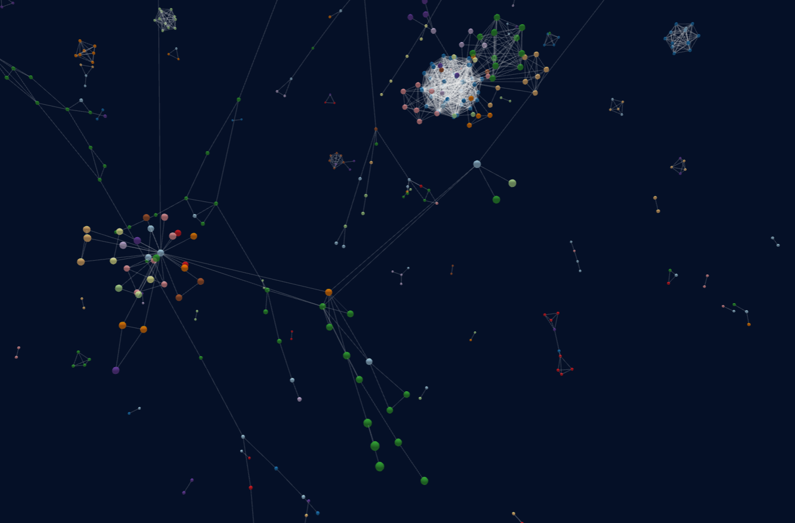

## ML-graph-community

This project aims to bring the AI/ML community in the MENA region closer by providing a graph-like networking platform, in this platform people are represented as nodes in a huge graph, the more similar these people are the closer they are in the graph space.  

researcher you are, ai engineer, data enthusiast or a student you have your node in our graph, you have your place in our community.



## issue we want to address

the ML and AI community in the MENA region is scattered, and so are their efforts, we aim to bring the community together and encourage it to engage in serious discussions to solve real-world problems.

we aim to answer the following questions for our users : 
- who can I collaborate with ?
- on what should we work on ?
- who should I ask for help in case needed ? 

## our philosophy 

- linked-in is not cool
- we want for our platform to be focused on people not posts.
- the social feed in other platforms is full of noise.
- we are always trapped by our social bubble, little do we explore to find new people.
- no likes, no private/ public, no every-day selfies, no more irrelevancy just pure networking.

## how it works ?

Each individual create a profile on our platform, including a short summary, area of work, his experiences and certification, we vectorize these profiles using a pre-trained bert model, and use compare them using cosine similarity, the higher the similarity the closer two nodes are pulled closer in the space.   


## prototype 

proof of concept :

- how we can represent and visualize people in the community as an undirected **graph**.
- how to **measure similarity** between different profiles (here we embed user's profile using a pre-trained bert model then we measure the cosine similarity with other profiles embeddings).

to test it out : 

### **measure similarity**

1- clone repo :
```
git clone https://github.com/1hachem/ML-Graph
```
2- install dependencies :
```
conda env create -f environment.yml
```
3- follow `similarity_measure.ipynb` notebook.
 
### **graph view**
1- run a localhost and open `index.html` in you browser.

## working on other features

- data market : sell and buy locally collected data.
- events page : share with and invite the community to you organized event.
- collaborate : create contracts and collaborate professionally with other people in the community.  
